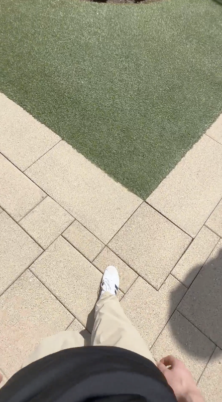

# FoG-Trigger Dataset

## **Citation**  
If you use this dataset in your research, please cite our paper:  

```
Chen Qian, Chuntian Chi, John Clapham, Jiarui Qi, Zherui Zhang, GinaMari Blackwell, Ingrid Pretzer-Aboff, Leslie Cloud, Meiyi Ma, Gang Zhou, and Huajie Shao. Trigger-Finder: A Real-Time Freezing-of-Gait Trigger Detection System Using an Instruction-Tuned Multimodal Large Language Model. CHASE 2025. DOI: https://doi.org/10.1145/3721201.3721387
``` 

## **Description**  
The FoG (Freezing of Gait) Trigger Dataset contains images annotated with potential triggers that may contribute to Freezing of Gait in individuals with Parkinson’s disease. The dataset includes labeled examples of five key triggers:  
- **Floor Pattern Changes**
  This label refers to situations where sudden or significant changes in floor patterns occur, such as transitions from one surface type to another (e.g., carpet to tile).
  
  Example of Floor Pattern Changes:

  

- **Tight Turns**
  This label refers to situations where the individual encounters a scenario requiring a tight turn, such as making a pivot greater than 90-degree.
  
  Example of Tight Turns:

  
  
- **Narrow Passages**
  This label refers to scenarios where the individual passes through a confined space, such as a doorway, hallway, or between closely positioned obstacles.
  
  Example of Narrow Passages:

  
  
- **Distraction**
  This label refers to situations where the individual encounters sudden visual or auditory distractions that may interrupt their walking pattern.
  
  Example of Narrow Passages:
  
  
  
- **Dual-Tasking**
  This label applies when the individual is engaged in two or more tasks simultaneously, such as opening the door and entering.
  
  Example of Dual-Tasking:

  

Each image is paired with ground truth labels and reasoning descriptions to facilitate research in explainable AI for FoG trigger detection. The raw images and labels can be found in the corresponding sub-folders with names indicating the location which images were captured. The entire data corpus in trainable format can be found in the all_labeled_dataset json file.

## **Files**
This repository contains the following files. You agree to the Terms of Use for FoG-Trigger Dataset to download and use the files.
| Files | Description | Size |
|----------|----------|----------|
| 0813_Campus | Segmented FoG trigger images, ground truth labels, and ground truth reasonings taken in William & Mary campus. There are 577 images taken in the first pernson's point of view. | 1.51GB |
| 0912_Mall | Segmented FoG trigger images, ground truth labels, and ground truth reasonings taken in a dontown shopping mall. There are 1361 images taken in the first pernson's point of view. | 3.08GB |
| 1009_Beach | Segmented FoG trigger images, ground truth labels, and ground truth reasonings taken in natural environment in a beach. There are 550 images taken in the first pernson's point of view. | 1.52GB |
| all_labeled_data.json | JSON file containing a structured dataset designed for Freezing of Gait (FoG) trigger detection in Parkinson’s disease patients. Each entry in the dataset represents an image labeled with potential FoG triggers, accompanied by a structured conversation prompt. Structure of Each Entry: id (string): A unique identifier for each sample. image (string): The file path to the corresponding image. conversations (list of dictionaries): A structured prompt-response pair designed for LLM-based analysis.| 6.1MB |

## **Instructions**
**1. Fine-tune Model**

Please follow the instructions on [MiniCPM]([https://example.com](https://github.com/OpenBMB/MiniCPM-o/tree/main?tab=readme-ov-file#efficient-inference-with-llamacpp-ollama-vllm)). We used the multimodality vision-language LLM, MiniCPM-V 2.6, as our base model.

**2. Load Model**

Please load the model after fine-tuning with the FoG-Trigger Dataset.
```
model = AutoModel.from_pretrained('MiniCPM-V-2_6', trust_remote_code=True, torch_dtype=torch.bfloat16) 
tokenizer = AutoTokenizer.from_pretrained('MiniCPM-V-2_6', trust_remote_code=True)
model = PeftModel.from_pretrained(
    model,
    path_to_adapter,
    device_map="auto",
    trust_remote_code=True
).eval().to(device)
```

**3. Define Prompt**
```
prompt = """
[Role]: You are a professional specializing in Parkinson's disease.
[Objective]: Your task is to identify and describe elements in an image that correspond to specific environmental triggers: floor pattern changes, tight turn, dual-tasking, narrow passage, and distraction.
[Input]: You will receive an image that might be seen in a First Person's POV.
[Task]:
Identify and list all significant elements visible in the image.
1. Element Identification: For each specified trigger, identify any relevant elements in the image that suggest the presence of that trigger, focusing ONLY on the following triggers: floor pattern changes, tight turn, dual-tasking, narrow passage, and distraction.
2. Description and Justification: For each element identified, describe why it corresponds to the specified trigger. Do NOT include any explanations or reasoning related to potential impacts on individuals. Focus solely on the characteristics of the image.

[Output Format]: Provide your analysis in TEXT. First, list the identified triggers separated by semicolons. Then, explain the reasoning for each identified trigger, focusing exclusively on its observable characteristics in the image.
Identified Triggers: [Identified triggers will be listed here].

Explanation:
[Your reasoning for each identified trigger will be written here. Provide a detailed explanation for each trigger, focusing ONLY on the ones identified in the image. Do NOT include any irrelevant explanations.]
"""
```

**4. Run Model**
```
def run(img_path):
    img = Image.open(img_path).convert('RGB')
    msgs = [{'role': 'user', 'content': [img, prompt]}]
        
    # Start time
    start_time = time.time()
        
    res = model.chat(
        image=None,
        msgs=msgs,
        tokenizer=tokenizer
    )
        
    # End time
    end_time = time.time()
        
    # Calculate the time taken and append to the list
    prediction_time = end_time - start_time
        
    dict = {
        'image_name': img_path,
        'response': res,
        'prediction_time': prediction_time
    }
    return dict
```

```img_path``` is the path to the target raw image.

## **Download**  
The dataset can be accessed at:  
[https://drive.google.com/file/d/1ZNQXpISN5c4p2l5HV5gzTrr02ZjZE4B4/view?usp=sharing]  


## **Terms of Use for FoG-Trigger Dataset**
You need to read and agree to the following terms of use to download and use the FoG-Trigger Dataset.
```
1. Definitions
```
The following terms, unless the context requires otherwise, have the following meanings:

“Data Team”: means the employees and students at William & Mary who are working on the FoG-Trigger Dataset;

“FoG-Trigger Dataset”: means the images containing potential FoG triggers collected by the Data Team;

“Licensee”, “You”, “Yours”: means the person or entity acquiring a license hereunder for access to and use of the FoG-Trigger Dataset.
```
2. Grant of License
```
William & Mary hereby grants to You a non-exclusive, non-transferable, revocable license to use the FoG-Trigger Dataset solely for Your non-commercial, educational, and research purposes only, but without any right to copy or reproduce, publish or otherwise make available to the public or communicated to the public, sell, rent or lend the whole or any constituent part of the FoG-Trigger Dataset thereof. The FoG-Trigger Dataset shall not be redistributed without the express written prior approval of William & Mary. You agree not to reverse engineer, separate or otherwise tamper with the FoG-Trigger Dataset so that data can be extracted and used outside the scope of that permitted in this Agreement.

You agree to acknowledge the source of the FoG-Trigger Dataset in all of Your publications and presentations based wholly or in part on the FoG-Trigger Dataset. You agree to provide a disclaimer in any publication or presentation to the effect that William & Mary does not bear any responsibility for Your analysis or interpretation of the Dataset.

You agree and acknowledge that William & Mary may hold, process, and store any personal data submitted by You for validation and statistical purposes and the purposes of the administration and management of the FoG-Trigger dataset. You agree that any personal data submitted by You is accurate to the best of his or her knowledge.

William & Mary provides the FoG-Trigger Dataset “AS IS,” without any warranty or promise of technical support, and disclaims any liability of any kind for any damages whatsoever resulting from use of the FoG-Trigger Dataset.

WILLIAM & MARY MAKES NO WARRANTIES, EXPRESS OR IMPLIED WITH RESPECT TO THE FOG-TRIGGER DATASET, INCLUDING ANY IMPLIED WARRANTY OF MERCHANTABILITY OR FITNESS FOR A PARTICULAR PURPOSE, WHICH ARE HEREBY EXPRESSLY DISCLAIMED.

Your acceptance and use of the FoG-Trigger Dataset binds you to the terms and conditions of this License as stated herein.
